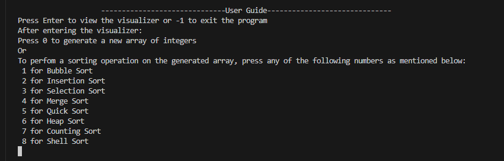
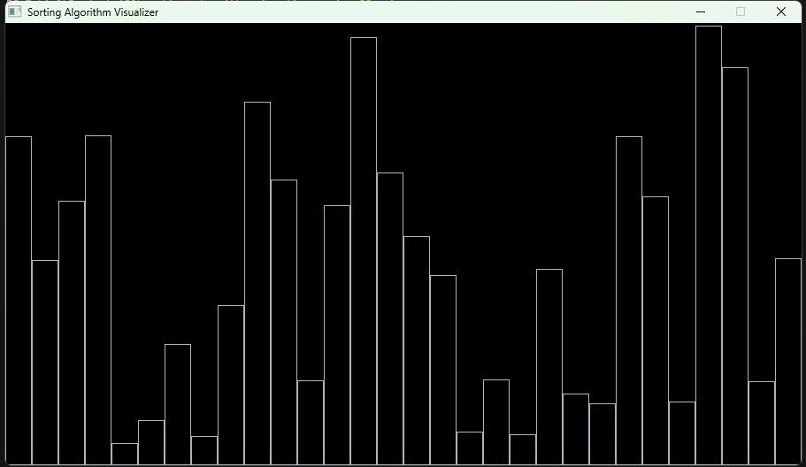
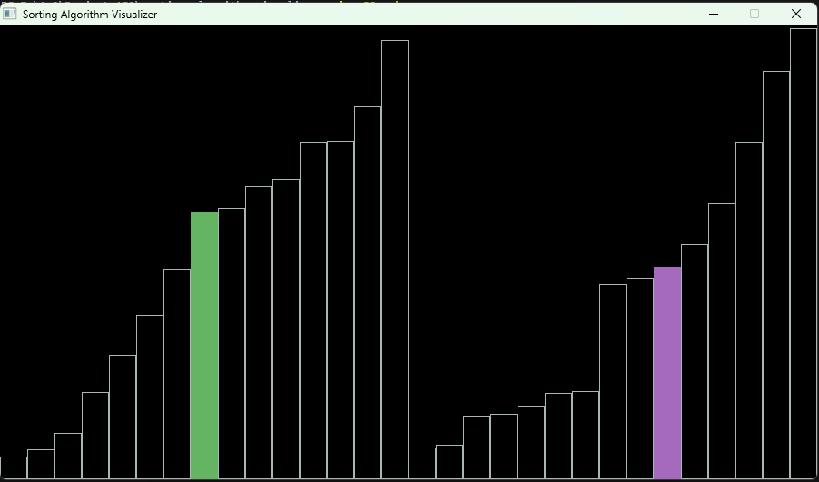
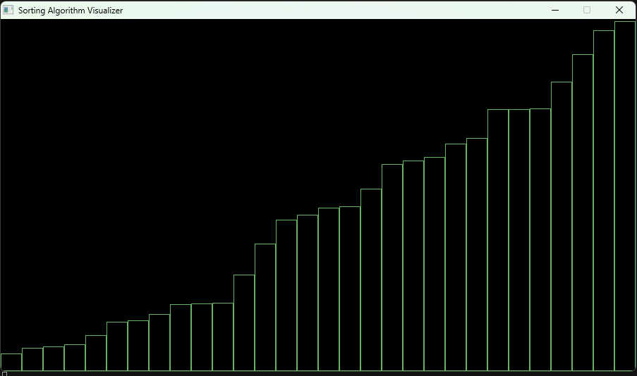
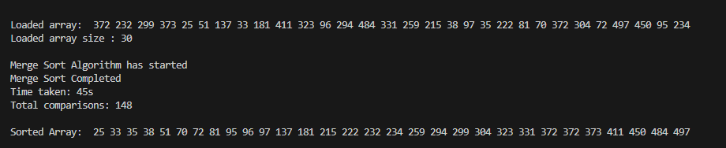

# Sorting Algorithm Visualizer

This project is a C++ application that brings sorting algorithms to life using the SDL2 library.
Built for our **CSE-150** course, it transforms abstract code into colorful, dynamic visuals, making it easier to see and understand how different sorting algorithms work step-by-step. Whether you’re learning the basics or just curious about algorithm behavior, this tool turns theory into an interactive experience.

## Features
- Visualizes sorting algorithms step-by-step
- Interactive and educational
- Built with SDL2 for cross-platform graphics

## Prerequisites
- **Windows OS** (other platforms may require adjustments)
- **g++** (MinGW recommended)
- **SDL2 development libraries**
  - The project includes SDL2 headers and libraries in `src/include` and `src/lib`.
- **Make** (optional, for using the provided Makefile)

## Project Structure
```
main.cpp                # Main application source code
Makefile                # Build script for compiling the project
SDL2.dll                # SDL2 runtime DLL (required for execution)
src/
  include/SDL2/         # SDL2 header files
  lib/                  # SDL2 library files
```

## Build Instructions
1. **Open a terminal in the project directory.**
2. **Run the following command:**
   ```sh
   mingw32-make
   ```
   This will compile `main.cpp` and link against the SDL2 libraries, producing an executable named `main.exe`.

   The Makefile uses:
   ```makefile
   g++ -I src/include -L src/lib -o main main.cpp -lmingw32 -lSDL2main -lSDL2
   ```
   - `-I src/include` specifies the location of SDL2 header files.
   - `-L src/lib` specifies the location of SDL2 library files.
   - `-lmingw32 -lSDL2main -lSDL2` links the required libraries.

3. **Ensure `SDL2.dll` is present in the project directory.**
   - This DLL is required for the application to run.

## Running the Application
1. After building, run the executable:
   ```sh
   ./main.exe
   ```
   Or double-click `main.exe` in the file explorer.
2. The application window will open, displaying the sorting visualization.

## How to Use
When you start the program, you will see a welcome message:

```
******************************WELCOME TO SORTING ALGORITHM VISUALIZER******************************
Press Enter to continue or -1 to exit the program:
```

- Press **Enter** to proceed to the sorting visualization.
- Enter **-1** and press Enter to exit the program.

Once inside the visualizer:
- Follow any on-screen instructions to select or observe sorting algorithms.

- Pressing **Enter** will open the visualizer window

- Choose any instructions per the *User Guide* to start that particular sorting algorithm. The *Green bar* and *Lavendar bar* indicates the number that is being compared in that particular render.

- After sorting process completes, all the borders turn *Dark Green*

- The terminal outputs the unsorted array, the algorithm used, total time taken by the algorithm(*with a delay of 150ms between each render*), total comparisons, and the sorted array.

- Press **Exit** to exit the visualizer or you can carry on visualizing different algorithms following the *User Guide*

## How It Works
- The application uses SDL2 to create a graphical window.
- Sorting algorithms are implemented in C++ and visualized by updating the display as the algorithm progresses.
- Each step of the sorting process is rendered, allowing users to observe how elements are moved and sorted.
- The visualization helps users understand the inner workings and efficiency of different sorting algorithms.

## Troubleshooting
- If you encounter errors related to missing SDL2 libraries, ensure that the `src/include` and `src/lib` directories contain the necessary files.
- Make sure `SDL2.dll` is in the same directory as `main.exe`.

## License
This project is licensed under the MIT License. See the LICENSE file for details.

Note: The project uses SDL2, which is licensed separately. Please refer to the SDL2 license for details regarding the use of SDL2 libraries.

## Credits
- SDL2: [https://www.libsdl.org/](https://www.libsdl.org/)
- Developed by [Muntasir Mamun](https://github.com/CharlieBrown110), [Naila Nausheen Rahman](https://github.com/nailannr) and Yarus Hossain Rafi
